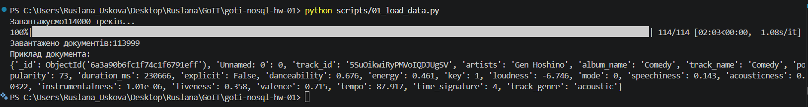
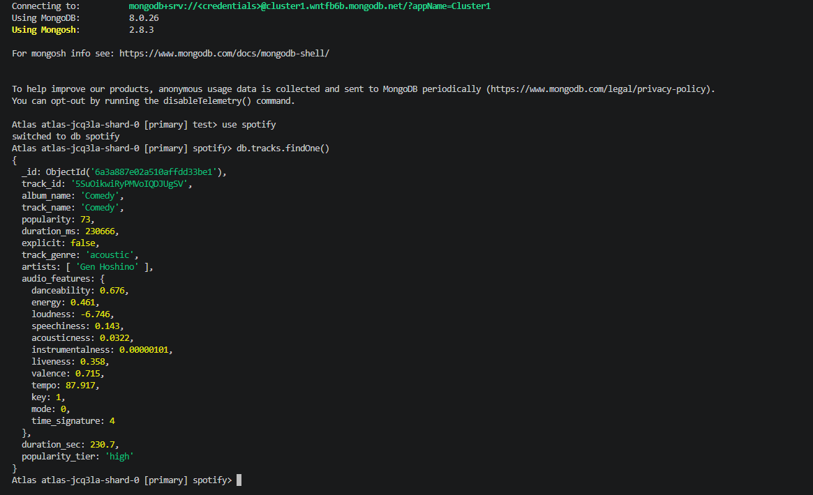
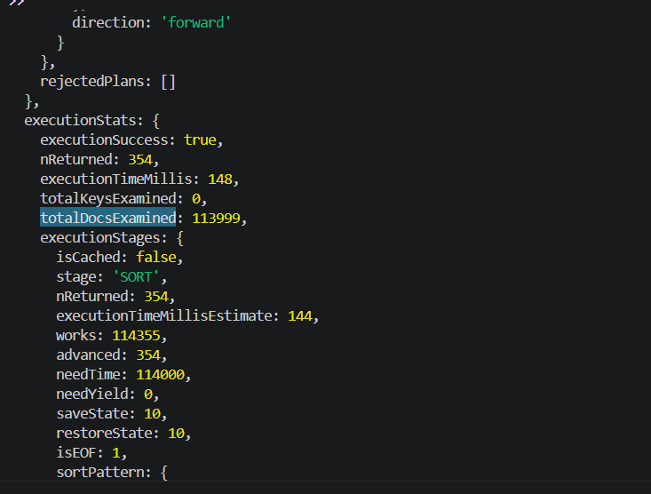

# Домашня робота №1. MongoDB

## Автор

Руслана Ускова

---

# Мета роботи

Метою роботи є завантаження даних Spotify до MongoDB Atlas, трансформація плоскої CSV-схеми у документоорієнтовану модель даних, виконання запитів та аналітики за допомогою Aggregation Pipeline, а також дослідження впливу індексів на продуктивність запитів.

---

# Налаштування оточення

## Встановлення залежностей

Встановити необхідні бібліотеки:

```bash
pip install -r requirements.txt
```

Використані залежності:

```txt
pymongo==4.7.3
pandas==3.0.3
kaggle==1.6.14
python-dotenv==1.0.1
tqdm==4.66.4
```

## Налаштування MongoDB Atlas

1. Створити кластер MongoDB Atlas.
2. У розділі Database Access створити користувача бази даних.
3. У розділі Network Access додати власну IP-адресу або дозволити доступ через `0.0.0.0/0`.
4. Отримати рядок підключення через:

```
Connect → Drivers
```

5. Створити файл `.env` у корені проєкту:

```env
MONGO_URI=mongodb+srv://<username>:<password>@cluster.mongodb.net/?retryWrites=true&w=majority
```

## Завантаження датасету

Було використано Spotify Tracks Dataset з Kaggle.

Файл `dataset.csv` необхідно розмістити у корені проєкту.

---

# Структура проєкту

```text
goti-nosql-hw-01/
│
├── dataset.csv
├── .env
├── requirements.txt
├── README.md
│
├── scripts/
│   ├── 01_load_data.py
│   └── 02_transform.js
│
└── queries/
    ├── part2_queries.js
    ├── part3_analytics.js
    └── part4_indexes.js
```

---

# Порядок запуску

## Крок 1. Завантаження даних

```bash
python scripts/01_load_data.py
```

Результат:

* створюється база даних `spotify`;
* створюється колекція `tracks_raw`;
* завантажуються дані з CSV.

---

## Крок 2. Трансформація схеми

```bash
mongosh "<MONGO_URI>" --file scripts/02_transform.js
```

Результат:

* створюється колекція `tracks`;
* формується вкладений документ `audio_features`;
* створюється масив виконавців `artists`;
* додаються обчислювані поля.

---

## Крок 3. Виконання запитів

```bash
mongosh "<MONGO_URI>" --file queries/part2_queries.js
```

---

## Крок 4. Виконання аналітики

```bash
mongosh "<MONGO_URI>" --file queries/part3_analytics.js
```

---

## Крок 5. Аналіз індексів

```bash
mongosh "<MONGO_URI>" --file queries/part4_indexes.js
```

---

# Підсумкова схема даних

Після трансформації кожен документ у колекції `tracks` має структуру:

```json
{
  "_id": "...",
  "track_id": "5SuOikwiRyPMVoIQDJUgSV",
  "track_name": "Comedy",
  "album_name": "Comedy",
  "artists": [
    "Gen Hoshino"
  ],
  "explicit": false,
  "popularity": 73,
  "duration_ms": 230666,
  "duration_sec": 230.7,
  "track_genre": "acoustic",
  "popularity_tier": "high",
  "audio_features": {
    "danceability": 0.676,
    "energy": 0.461,
    "loudness": -6.746,
    "speechiness": 0.143,
    "acousticness": 0.0322,
    "instrumentalness": 0.000017,
    "liveness": 0.358,
    "valence": 0.715,
    "tempo": 87.917,
    "key": 1,
    "mode": 0,
    "time_signature": 4
  }
}
```

## Опис полів

* `artists` — масив виконавців треку.
* `audio_features` — вкладений документ із музичними характеристиками.
* `duration_sec` — обчислюване поле тривалості в секундах.
* `popularity_tier` — категорія популярності (`high`, `medium`, `low`).

---

# Частина 1. Теоретичні питання

## 1. Чому аудіохарактеристики винесені в окремий об'єкт?

Аудіохарактеристики описують одну логічну сутність — музичні властивості треку. Зберігання їх у вкладеному документі `audio_features` дозволяє згрупувати пов'язані поля та зробити структуру документа зрозумілішою.

Таке рішення полегшує підтримку схеми та роботу із запитами до аудіофіч. Недоліком може бути дещо складніша індексація через використання вкладених полів.

---

## 2. Чому виконавці зберігаються як масив?

Один трек може містити декількох виконавців.

Масив дозволяє:

* легко знаходити треки конкретного виконавця;
* використовувати `$unwind`;
* будувати статистику по артистах;
* виконувати пошук через `$in` та `$elemMatch`.

Якби виконавці зберігались рядком, кожен запит потребував би додаткового розбору тексту.

---

## 3. Різниця між `$out` та `$merge`

`$out` повністю створює або перезаписує колекцію результатом агрегації.

`$merge` дозволяє оновлювати або доповнювати існуючу колекцію без її повного видалення.

У даній роботі використання `$out` є доречним, оскільки колекція `tracks` формується заново із сирих даних.

---

# Частина 2. Теоретичні питання

## 1. Для чого використовується `$unwind`?

`$unwind` розгортає масив у набір окремих документів.

Наприклад, якщо трек має трьох виконавців, після `$unwind` буде створено три записи для подальшої агрегації.

---

## 2. Різниця між `$stdDevPop` та `$stdDevSamp`

`$stdDevPop` використовується для генеральної сукупності та ділить на `N`.

`$stdDevSamp` використовується для вибірки та ділить на `N-1`.

Оскільки аналіз виконується над усім набором даних Spotify, коректніше використовувати `$stdDevPop`.

---

# Частина 3. Теоретичні питання

## 1. Вплив порога кількості треків виконавця

При зменшенні порога до 1 у результати потраплять виконавці лише з одним треком. Це знижує статистичну достовірність середньої популярності.

При збільшенні порога до 50 залишаються лише найактивніші виконавці, а результати стають більш репрезентативними.

---

## 2. Вплив порога кількості треків жанру

Зменшення порога зі 100 до 50 дозволяє включити більше жанрів до аналізу.

Водночас жанри з невеликою кількістю треків сильніше піддаються впливу окремих аномальних значень.

---

# Частина 4. Аналіз індексів

## Завдання 4.1

### До створення індексу

MongoDB використовувала:

```text
COLLSCAN
```

Показники:

* executionTimeMillis = 95
* totalDocsExamined = 113999
* totalKeysExamined = 0

Система виконувала повне сканування колекції.

### Після створення індексу

Було створено індекс:

```js
{
  track_genre: 1,
  "audio_features.danceability": 1,
  popularity: -1
}
```

Індекс:

```text
genre_danceability_popularity_idx
```

Показники:

* executionTimeMillis = 2
* totalDocsExamined = 354
* totalKeysExamined = 354
* stage = IXSCAN

### Висновок

Після створення індексу кількість переглянутих документів зменшилась із 113999 до 354, а час виконання скоротився з 95 мс до 2 мс.

---

## Завдання 4.2

Було створено індекс:

```js
{
  "audio_features.instrumentalness": 1,
  "audio_features.speechiness": 1,
  explicit: 1
}
```

Індекс:

```text
work_music_idx
```

У плані виконання використовується:

```text
IXSCAN
```

Показники:

* totalKeysExamined = 16844
* totalDocsExamined = 16141

Це підтверджує використання індексу для пошуку музики для роботи.

---

## Завдання 4.3. Covered Query

Розглянемо запит:

```js
db.tracks.find({
  track_genre: "pop",
  popularity: { $gte: 70 }
})
```

Даний запит не є covered query.

Причина полягає в тому, що MongoDB після пошуку через індекс виконує етап:

```text
FETCH
```

Це означає, що система звертається до документів колекції для отримання даних.

Covered Query можлива лише тоді, коли всі поля фільтрації та всі поля, які повертаються запитом, містяться в індексі.

Оскільки запит повертає повний документ, MongoDB змушена виконувати додаткове читання колекції, тому запит не є покривним.


# Скріншоти

## Завантаження даних



## Приклад документа tracks



## Explain до створення індексу


## Explain після створення індексу


---


# Висновки

У результаті роботи:

- Завантажено 114000+ треків.
- Створено колекцію tracks із документоорієнтованою схемою.
- Реалізовано 4 запити для аналізу даних.
- Реалізовано 3 аналітичні пайплайни.
- Створено 2 складені індекси.
- Підтверджено прискорення запиту з 95 мс до 2 мс після індексації.

Результати показали, що правильно побудовані індекси дозволяють суттєво зменшити кількість переглянутих документів та прискорити виконання запитів.
